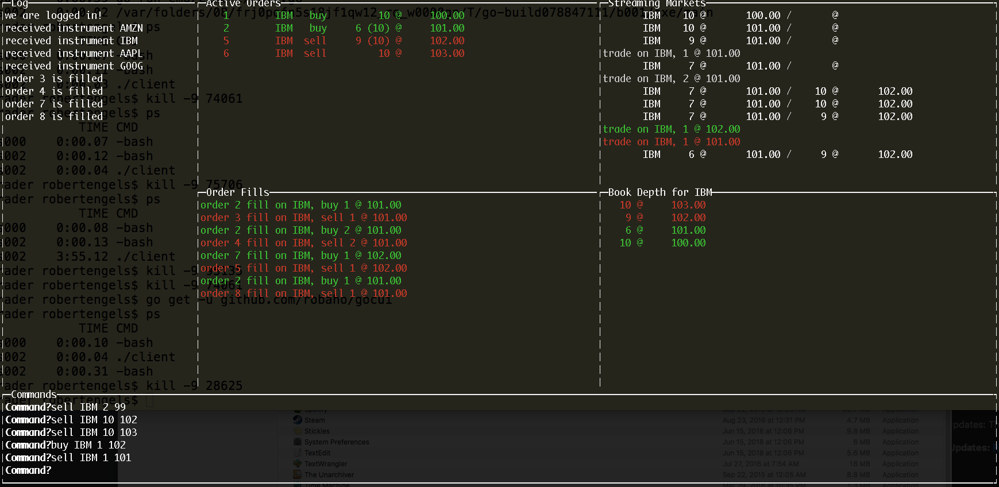

# go-trader

A financial exchange written in Go. Uses quickfixgo for client/server communication. Uses UDP multicast for market distribution.

The client offers a command line GUI, "market maker", and a "playback".

The exchange itself has a bare bones web interface, that uses web sockets to provide real-time book updates.

The exchange is designed to allow for easy back-testing of trading strategies. It supports limit and market orders.

It was primarily developed to further my knowledge of Go and test its suitability for high-performance financial applications.

# install

go get github.com/robaho/go-trader

# build

go install github.com/robaho/go-trader/cmd/exchange

go install github.com/robaho/go-trader/cmd/client

go install github.com/robaho/go-trader/cmd/marketmaker

go install github.com/robaho/go-trader/cmd/playback

# run

cd $GOPATH/src/github.com/robaho/go-trader/cmd

exchange &

marketmaker -symbol IBM

client

# REST api

access full book (use guest/password to login)

localhost:8080/api/book/SYMBOL

# screen shots

# ToDos

Add more REST api methods

Ability to add instruments on the fly

Support instruments other than equities (options, futures, spreads, etc.)

 
